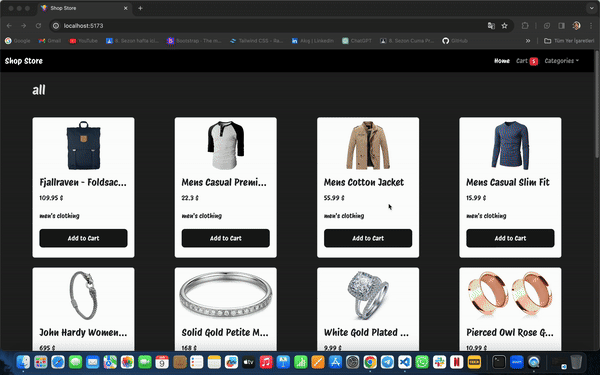

# HOC (Higher Order Components)

- Yüksek Düzey Bileşenler

- İçeriği children prop'u olarak daha sonrasında gönderebildiğimiz bileşenler.
- Prop olarak farklı bileşenleri alan üst düzey bileşenler.

# CONTEXT (CONTEXT-API)

- Verileri uygulamadaki bileşenlerden bağımsız noktalarda yönetmemizi sağlar.

# shopstore-react

# shopstore-react

Hello! I've completed a shopping website project using React and I'm excited to share it with you. In this project, I aimed to provide a shopping experience covering a wide range of products, from jewelry to electronics, and from men's to women's clothing, by fetching our data from an API.

I used React Router to navigate between pages and to display products specific to categories. Additionally, I managed shared data across the application using the Context API structure, enabling cleaner and more effective data communication between components.

While performing actions like adding, removing, and deleting items from the cart, I displayed notifications to the user using the React Toastify library. Moreover, I made my project responsive using the Bootstrap library, ensuring a seamless user experience across different devices.

I look forward to hearing your feedback and thoughts about my project. Thank you in advance!

